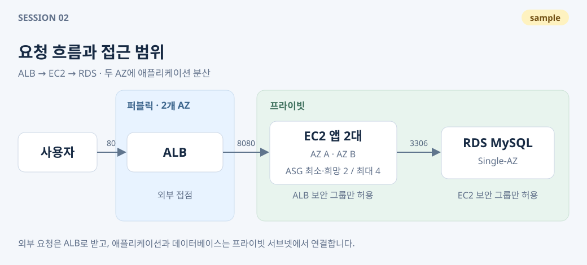
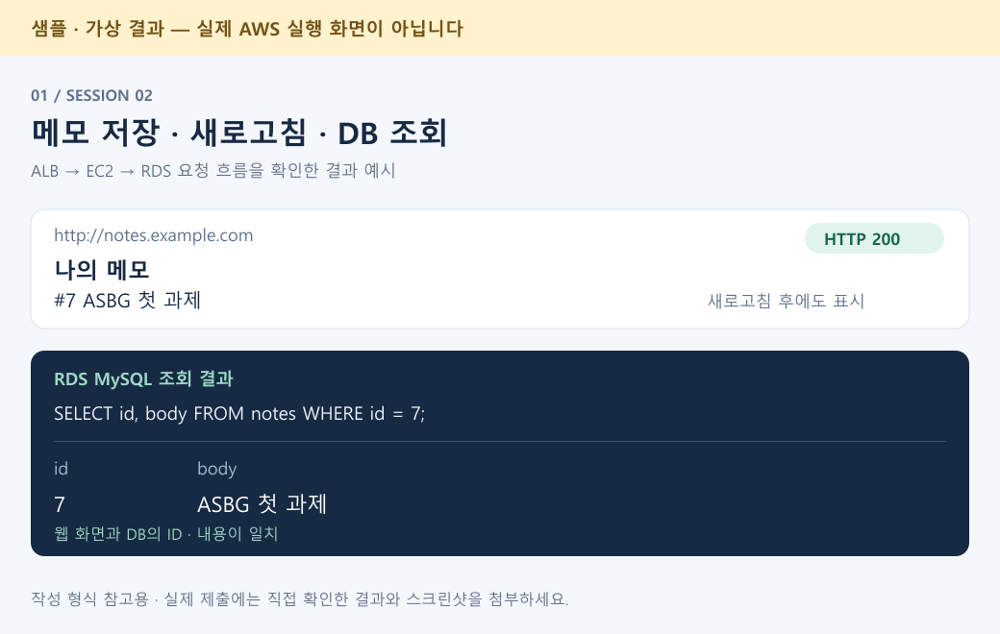
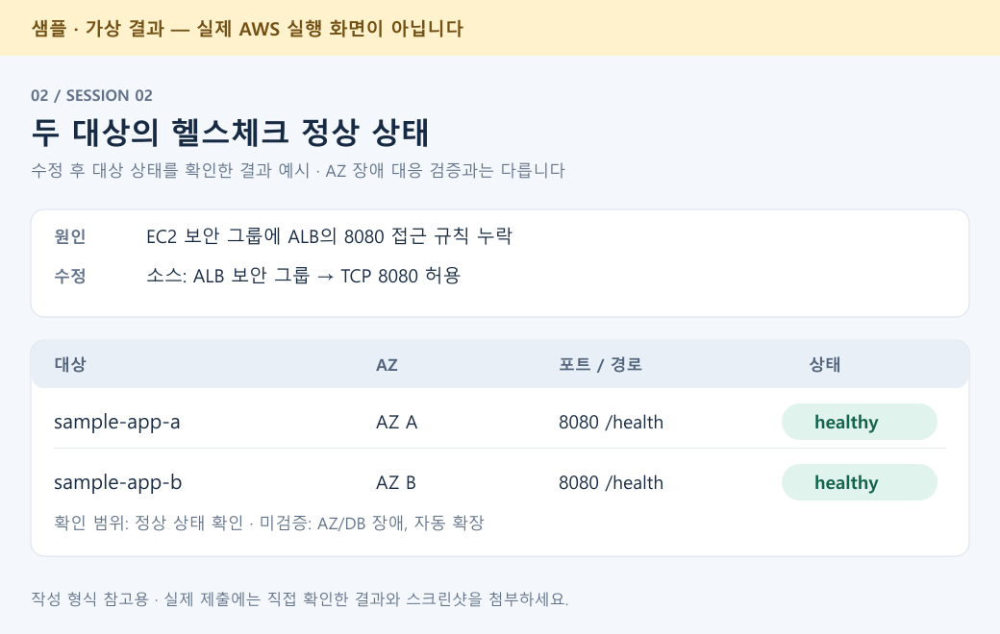

# Session 02 · 메모 웹 서비스 [샘플]

- 제출자: 샘플 멤버 (`sample-member`)
- 과제명: ALB–EC2–RDS로 메모 저장·조회하기

> **작성법을 보여 주는 가상 예시입니다.** 아래 조건과 이미지는 실제 과제 공지나 AWS 실행 기록이 아닙니다. 실제 제출에는 본인의 설명 자료와 직접 확인한 검증 자료를 넣으세요.

## 1. What I Built

ALB → EC2 애플리케이션 → RDS MySQL로 연결되는 메모 서비스를 구성했습니다. ALB가 EC2 두 대로 요청을 분산하고, 메모는 DB에 저장해 새로고침 후에도 조회할 수 있습니다.

## 2. Design Decisions

- **서비스 구성:** ALB는 두 AZ의 퍼블릭 서브넷에, EC2와 RDS는 프라이빗 서브넷에 배치해 외부 접점을 ALB로 제한했습니다.
- **접근 범위:** EC2의 8080 포트는 ALB 보안 그룹에서만, RDS의 3306 포트는 EC2 보안 그룹에서만 접근하도록 했습니다.
- **용량과 한계:** EC2 Auto Scaling은 최소·희망 2대, 최대 4대입니다. RDS는 비용을 줄이기 위해 Single-AZ를 선택했습니다. DB·AZ 장애와 부하에 따른 자동 확장은 이번에 검증하지 않았습니다.

## 3. Troubleshooting

- **문제와 원인:** 대상 그룹의 헬스체크가 타임아웃으로 실패했습니다. EC2 내부의 `curl http://localhost:8080/health`는 200을 반환했지만, EC2 보안 그룹에 ALB의 8080 접근을 허용하는 규칙이 없었습니다.
- **해결:** EC2 보안 그룹의 8080 인바운드 소스를 ALB 보안 그룹으로 추가했습니다.
- **재확인:** 아래 ‘대상 두 대 정상 상태’에서 두 대상이 `healthy`로 바뀐 결과를 확인했습니다.

## 4. Screenshots

**완료 조건: ALB를 통한 접속과 메모 저장·조회**

- **확인 방법:** 예시 주소 `http://notes.example.com`에서 ‘ASBG 첫 과제’를 저장하고 새로고침했습니다. DB에서도 같은 메모를 조회했습니다.
- **확인 결과:** HTTP 200 응답과 메모 목록이 보였고, 웹과 DB에서 같은 ID·내용을 확인했습니다. **충족 · 가상 결과**

**완료 조건: 대상 두 대 정상 상태**

- **확인 방법:** 보안 그룹 수정 후 대상 그룹에서 두 EC2의 상태를 확인했습니다.
- **확인 결과:** `/health`에 대한 두 대상의 상태가 모두 `healthy`였습니다. **충족 · 가상 결과**

