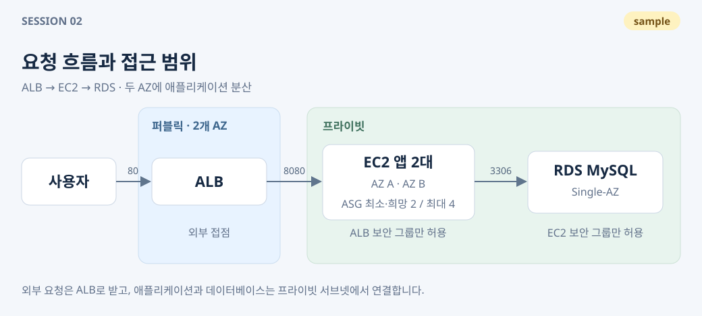
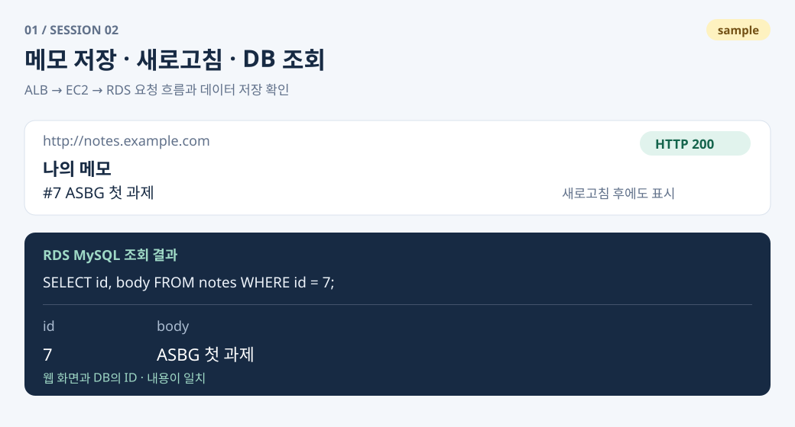
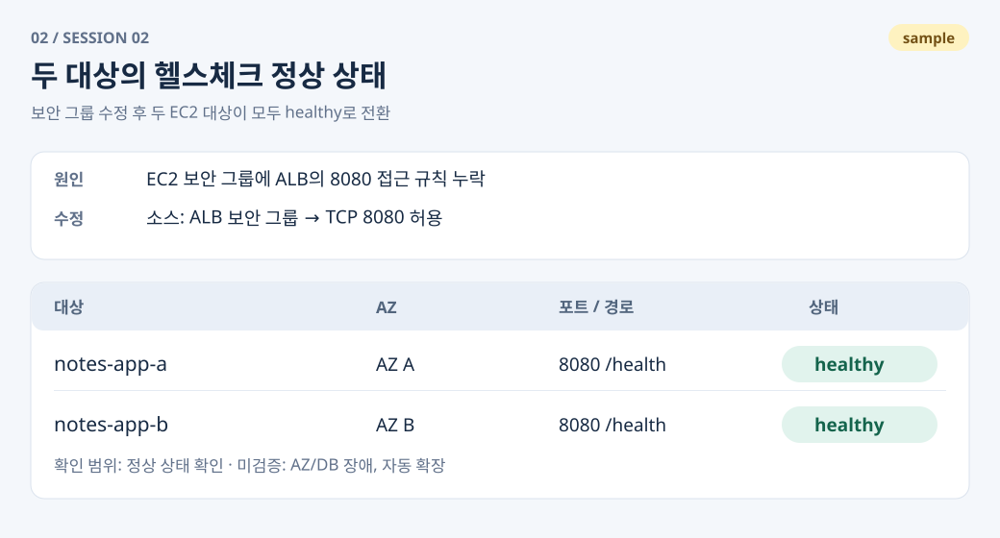

# Session 02 · 메모 웹 서비스

- 제출자: 홍길동
- 과제명: ALB–EC2–RDS로 메모 저장·조회하기

## 1. What I Built

ALB → EC2 애플리케이션 → RDS MySQL로 연결되는 메모 서비스를 구성했습니다. EC2 두 대를 ALB 대상 그룹에 등록했고, 메모는 DB에 저장해 새로고침 후에도 조회할 수 있습니다.

## 2. Design Decisions

- **서비스 구성:** ALB는 두 AZ의 퍼블릭 서브넷에, EC2와 RDS는 프라이빗 서브넷에 배치해 외부 접점을 ALB로 제한했습니다.
- **접근 범위:** EC2의 8080 포트는 ALB 보안 그룹에서만, RDS의 3306 포트는 EC2 보안 그룹에서만 접근하도록 했습니다.
- **용량과 한계:** EC2 Auto Scaling은 최소·희망 2대, 최대 4대입니다. RDS는 비용을 줄이기 위해 Single-AZ를 선택했습니다. DB·AZ 장애와 부하에 따른 자동 확장은 이번에 검증하지 않았습니다.

## 3. Troubleshooting & Validation

### 사례 1 · 헬스체크 실패 해결

- **점검 대상:** ALB 대상 그룹의 헬스체크가 타임아웃으로 실패하는 문제를 확인했습니다.
- **확인 과정과 조치:** EC2 내부의 `curl http://localhost:8080/health`는 200을 반환했지만 ALB에서는 응답을 받지 못했습니다. 보안 그룹 규칙을 비교해 ALB의 8080 접근이 허용되지 않은 것을 확인했고, EC2의 8080 인바운드 소스로 ALB 보안 그룹을 추가했습니다.
- **결과와 근거:** 변경 후 두 대상이 모두 `healthy`로 바뀌었습니다. 4번의 ‘대상 두 대 정상 상태’에 결과를 첨부했습니다.
- **검증 범위와 한계:** 두 대상의 정상 상태까지 확인했습니다. 한 대상이 중단되었을 때의 요청 전환은 검증하지 않았습니다. 추가 점검에서는 EC2 한 대의 애플리케이션을 중단하고, 남은 대상을 통해 메모 조회가 이어지는지 확인하겠습니다.

### 사례 2 · 오류 없이 메모 저장·조회 점검

- **점검 대상:** ALB를 통해 저장한 메모가 새로고침 후에도 유지되고, DB에 같은 내용으로 저장되는지 확인했습니다.
- **확인 과정과 조치:** 메모 저장 후 HTTP 응답, 새로고침한 웹 화면, DB 조회 결과를 비교했습니다. 응답이 200이고 웹과 DB의 ID·내용이 일치해, 확인한 저장·조회 흐름은 정상이라고 판단했습니다. 이 점검에서는 오류가 발견되지 않아 설정 변경은 하지 않았습니다.
- **결과와 근거:** 새로고침 후에도 같은 메모가 조회되었습니다. 4번의 ‘ALB를 통한 접속과 메모 저장·조회’에 웹 화면과 DB 결과를 함께 첨부했습니다.
- **검증 범위와 한계:** 단일 메모의 저장·조회 흐름을 확인했습니다. 동시 요청이나 중복 요청에 대한 처리는 검증하지 않았습니다. 추가 점검에서는 여러 요청을 함께 보내고, 예상한 저장 건수와 실제 DB 결과를 비교하겠습니다.

## 4. Screenshots

**완료 조건: ALB를 통한 접속과 메모 저장·조회**

- **확인 방법:** `http://notes.example.com`에서 ‘ASBG 첫 과제’를 저장하고 새로고침했습니다. DB에서도 같은 메모를 조회했습니다.
- **확인 결과:** HTTP 200 응답과 메모 목록이 보였고, 웹과 DB에서 같은 ID·내용을 확인했습니다. **충족**

**완료 조건: 대상 두 대 정상 상태**

- **확인 방법:** 보안 그룹 수정 후 대상 그룹에서 두 EC2의 상태를 확인했습니다.
- **확인 결과:** `/health`에 대한 두 대상의 상태가 모두 `healthy`였습니다. **충족**

